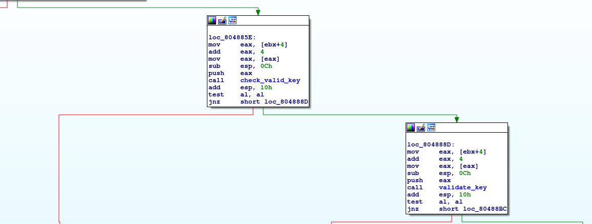
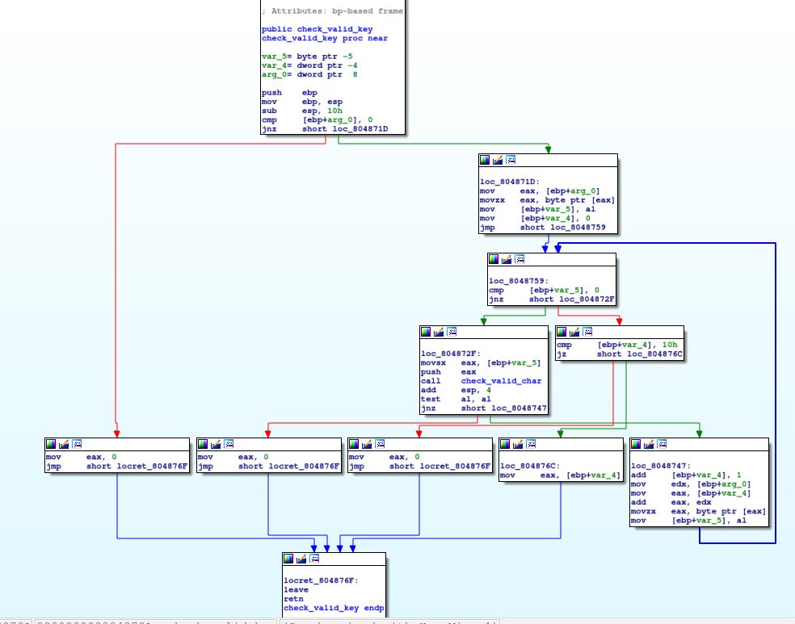
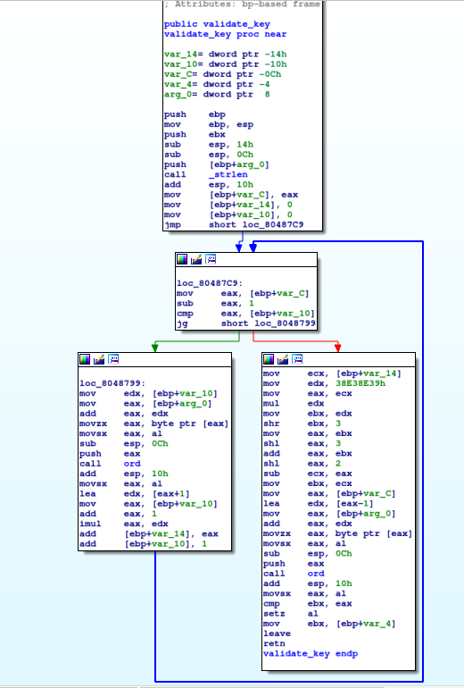
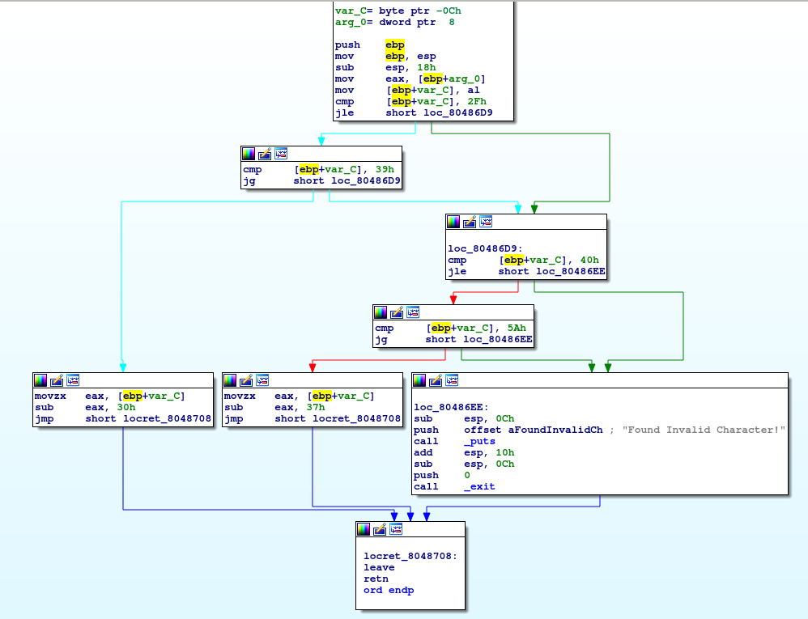

# Problem
Can you generate a valid product key for the validation [program](https://2018shell1.picoctf.com/static/a9ea8df4fd1086f02554dcbdbe627457/activate) in /problems/keygen-me-1_1_8eb35cc7858ff1d2f55d30e5428f30a7

## Hints:

## Solution:

Lets download the file and try to execute it:
```bash
wget https://2018shell1.picoctf.com/static/a9ea8df4fd1086f02554dcbdbe627457/activate
chmod +x ./activate
./activate

Usage: ./activate <PRODUCT_KEY>

./activate a

Please Provide a VALID 16 byte Product Key.
```

We need to find a valid key!
Lets ovserve with IDA:



We need to pass two checks: ```check_valid_key```, ```validate_key```.

First lets look at ```check_valid_key```:



We must enter a 16 byte key, and all chars must pass ```check_valid_char``` ([0-9A-Z]).

Now ```validate_key```:




The loop calculates ```sigma i=1 to 15((ord(key[i-1]) + 1) * i)```, where ```ord``` returns the ordinary value of the char (A=10, B=11...).

After that:
* This ```sum``` is being multiplied by ```38E38E39h``` and shift rotates right ```3``` bits, [which is](http://www.hackersdelight.org/magic.htm) effectively division by ```36```.
* Shift rotates left ```3``` bits, which means multiplication by ```8```. Lets call this number ```a```.
* Sets ```a := 36a```.
* Calculates ```sum - a```.
* **Until now it is just calculation of ```sum % 36```**.
* Check if the last char of the key equals this reminder.

In other words, the validation multiplies each char (but the last) of the key by its index, and gets the sum (modulo 36). Then it compares this with the last char.

If we set all but last chars to zero, and we call the last ```x```, the remainder will be:
```(1+2+3+4+5+6+7+8+9+10+11+12+13+14+15) % 36```, which is: ```12```.
We want this to be equal to ```x```.

A valid key will be ```000000000000000C```

Now lets get the flag:
```python
#!/usr/bin/env python

from pwn import *


user = ''
pw = ''

debug = 0

key = '000000000000000C'

if debug:
	p = process('./activate {}'.format(key), shell=True)
else:
	s = ssh(host = '2018shell1.picoctf.com', user=user, password=pw)
	s.set_working_directory('/problems/keygen-me-1_1_8eb35cc7858ff1d2f55d30e5428f30a7')

	p = s.process('./activate {}'.format(key), shell=True)

print p.recvall()
```

Flag: picoCTF{k3yg3n5_4r3_s0_s1mp13_3718231394}
