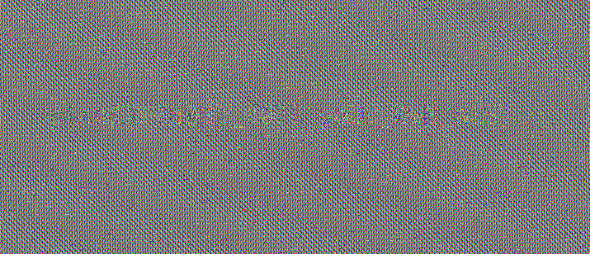

# Problem
AES-ECB is bad, so I rolled my own cipher block chaining mechanism - Addition Block Chaining! You can find the source here: [aes-abc.py](https://2019shell1.picoctf.com/static/cfeefe54f8057d49938e8f7d7038aa14/aes-abc.py). The AES-ABC flag is [body.enc.ppm](https://2019shell1.picoctf.com/static/cfeefe54f8057d49938e8f7d7038aa14/body.enc.ppm)

## Hints:

You probably want to figure out what the flag looks like in ECB form...

## Solution:

First, let's get the files:
```bash
wget https://2019shell1.picoctf.com/static/cfeefe54f8057d49938e8f7d7038aa14/aes-abc.py
wget https://2019shell1.picoctf.com/static/cfeefe54f8057d49938e8f7d7038aa14/body.enc.ppm
```

Let's see the code:
```python
#!/usr/bin/env python

from Crypto.Cipher import AES
from key import KEY
import os
import math

BLOCK_SIZE = 16
UMAX = int(math.pow(256, BLOCK_SIZE))


def to_bytes(n):
    s = hex(n)
    s_n = s[2:]
    if 'L' in s_n:
        s_n = s_n.replace('L', '')
    if len(s_n) % 2 != 0:
        s_n = '0' + s_n
    decoded = s_n.decode('hex')

    pad = (len(decoded) % BLOCK_SIZE)
    if pad != 0: 
        decoded = "\0" * (BLOCK_SIZE - pad) + decoded
    return decoded


def remove_line(s):
    # returns the header line, and the rest of the file
    return s[:s.index('\n') + 1], s[s.index('\n')+1:]


def parse_header_ppm(f):
    data = f.read()

    header = ""

    for i in range(3):
        header_i, data = remove_line(data)
        header += header_i

    return header, data
        

def pad(pt):
    padding = BLOCK_SIZE - len(pt) % BLOCK_SIZE
    return pt + (chr(padding) * padding)


def aes_abc_encrypt(pt):
    cipher = AES.new(KEY, AES.MODE_ECB)
    ct = cipher.encrypt(pad(pt))

    blocks = [ct[i * BLOCK_SIZE:(i+1) * BLOCK_SIZE] for i in range(len(ct) / BLOCK_SIZE)]
    iv = os.urandom(16)
    blocks.insert(0, iv)
    
    for i in range(len(blocks) - 1):
        prev_blk = int(blocks[i].encode('hex'), 16)
        curr_blk = int(blocks[i+1].encode('hex'), 16)

        n_curr_blk = (prev_blk + curr_blk) % UMAX
        blocks[i+1] = to_bytes(n_curr_blk)

    ct_abc = "".join(blocks)
 
    return iv, ct_abc, ct


if __name__=="__main__":
    with open('flag.ppm', 'rb') as f:
        header, data = parse_header_ppm(f)
    
    iv, c_img, ct = aes_abc_encrypt(data)

    with open('body.enc.ppm', 'wb') as fw:
        fw.write(header)
        fw.write(c_img)
```

Let's try to revert this and get the ciphertext (```ct```):
```python
#!/usr/bin/env python

from Crypto.Cipher import AES
# from key import KEY
import os
import math

BLOCK_SIZE = 16
UMAX = int(math.pow(256, BLOCK_SIZE))


def to_bytes(n):
    s = hex(n)
    s_n = s[2:]
    if 'L' in s_n:
        s_n = s_n.replace('L', '')
    if len(s_n) % 2 != 0:
        s_n = '0' + s_n
    decoded = s_n.decode('hex')

    pad = (len(decoded) % BLOCK_SIZE)
    if pad != 0: 
        decoded = "\0" * (BLOCK_SIZE - pad) + decoded
    return decoded


def remove_line(s):
    # returns the header line, and the rest of the file
    return s[:s.index('\n') + 1], s[s.index('\n')+1:]


def parse_header_ppm(f):
    data = f.read()

    header = ""

    for i in range(3):
        header_i, data = remove_line(data)
        header += header_i

    return header, data
        

def pad(pt):
    padding = BLOCK_SIZE - len(pt) % BLOCK_SIZE
    return pt + (chr(padding) * padding)


def aes_abc_encrypt(pt):
    cipher = AES.new(KEY, AES.MODE_ECB)
    ct = cipher.encrypt(pad(pt))

    blocks = [ct[i * BLOCK_SIZE:(i+1) * BLOCK_SIZE] for i in range(len(ct) / BLOCK_SIZE)]
    iv = os.urandom(16)
    blocks.insert(0, iv)
    
    for i in range(len(blocks) - 1):
        prev_blk = int(blocks[i].encode('hex'), 16)
        curr_blk = int(blocks[i+1].encode('hex'), 16)

        n_curr_blk = (prev_blk + curr_blk) % UMAX
        blocks[i+1] = to_bytes(n_curr_blk)

    ct_abc = "".join(blocks)
 
    return iv, ct_abc, ct

def from_bytes(b):
    decoded = b.replace("\0", "")
    s_n = decoded.encode('hex')
    n = int(s_n, 16)

    return n

def aes_abc_decrypt(c_img):
    blocks = [c_img[i * BLOCK_SIZE:(i+1) * BLOCK_SIZE] for i in range(len(c_img) / BLOCK_SIZE)]

    for i in range(len(blocks) - 2, -1, -1):
        n_curr_blk = from_bytes(blocks[i+1])
        n_prev_blk = from_bytes(blocks[i])

        curr_blk = (n_curr_blk - n_prev_blk) % UMAX

        blocks[i+1] = to_bytes(curr_blk)

    ct = ''.join(blocks[1:])

    return ct
    # print blocks

if __name__=="__main__":
    with open('body.enc.ppm', 'rb') as f:
        header, c_img = parse_header_ppm(f)
    
    ct = aes_abc_decrypt(c_img)

    # for d in data:
        # print len(d), type(d), d
    # iv, c_img, ct = aes_abc_encrypt(data)

    with open('flag.ppm', 'wb') as fw:
        fw.write(header)
        fw.write(ct)
```

Now we got the [ECB encryption](https://en.wikipedia.org/wiki/Block_cipher_mode_of_operation#Electronic_Codebook_(ECB)) of the original flag.
We know that ECB is not secure, since same blocks enctypted to the same ciphertext.


Let's take a look at the resulted image:


Nice :)

Flag: picoCTF{d0Nt_r0ll_yoUr_0wN_aES}
